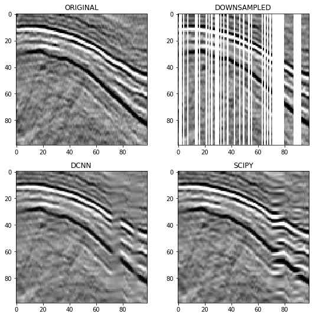

## This was my capstone project for Udacity Machine Learning Engineer Nano Degree 

./project/train_main.ipynb  ---> training notebook

In this project, I have trained a Deep Convolutional Neural Network to fill missing
traces in seismic data.

Here is an illustration of the result and a comparison with an interpolation by SciPy.

No magic over big gaps, but still the restoration by NN is better than by a standard library.
No artifacts were introduced, which is more important than filling the gaps.

